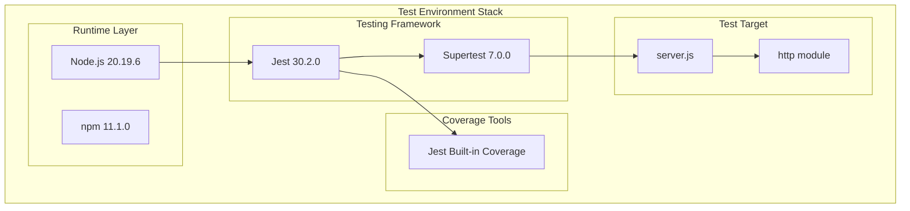
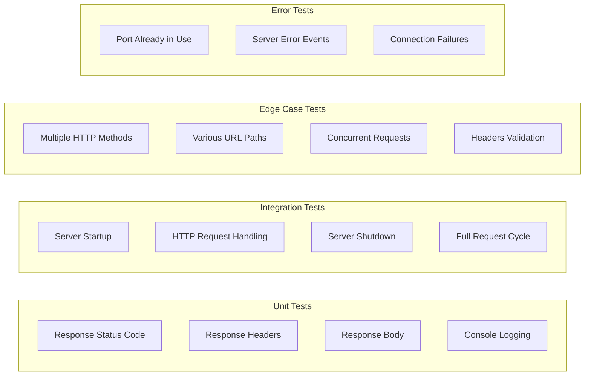
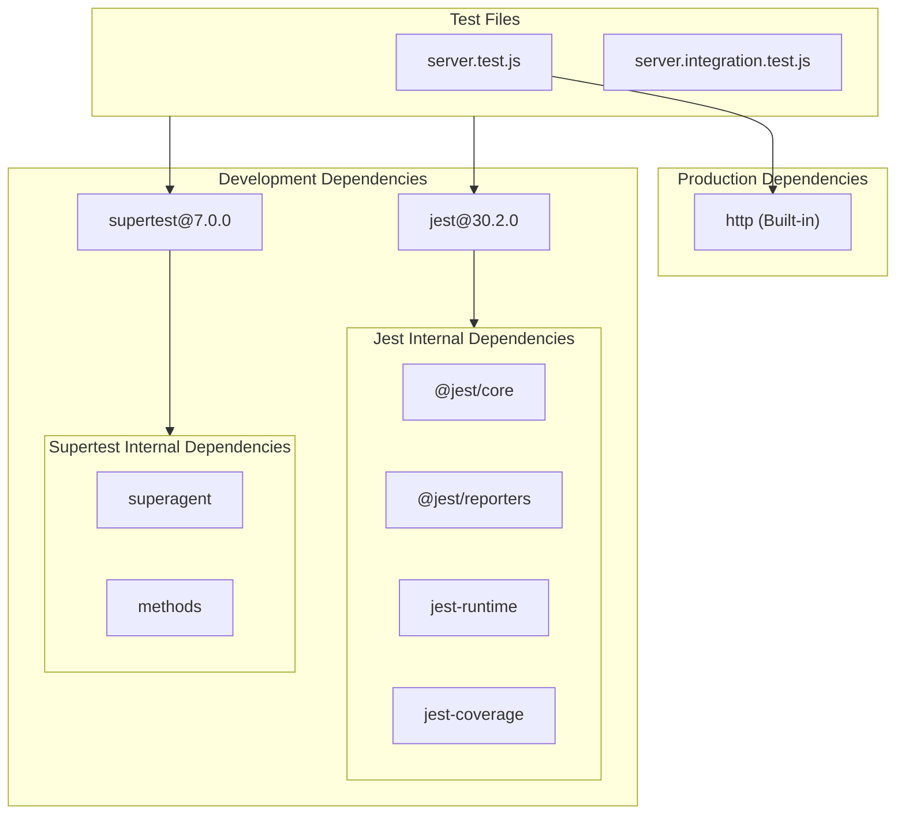

# Technical Specification

# 0. Agent Action Plan

## 0.1 Intent Clarification

This section captures and clarifies the user's testing requirements, translating them into precise technical implementation objectives.

### 0.1.1 Core Testing Objective

Based on the provided requirements, the Blitzy platform understands that the testing objective is to **create comprehensive unit tests for server.js using Jest or Mocha**. This is a test creation request for an existing Node.js HTTP server module with no current test coverage.

**Request Category:** Add New Tests (Greenfield Test Implementation)

The user has specified the following testing requirements with enhanced clarity:

| Requirement | User Statement | Technical Interpretation |
|-------------|----------------|--------------------------|
| Test HTTP Responses | "Test HTTP responses" | Verify that HTTP requests return the expected response body "Hello, World!\n" |
| Test Status Codes | "status codes" | Validate that all requests return HTTP 200 OK status |
| Test Headers | "headers" | Confirm Content-Type: text/plain header is set correctly |
| Test Server Startup | "server startup/shutdown" | Verify server can start listening on configured port without errors |
| Test Server Shutdown | "server startup/shutdown" | Validate graceful server shutdown and resource cleanup |
| Test Error Handling | "error handling" | Test behavior when port is occupied, invalid requests, and error scenarios |
| Test Edge Cases | "edge cases" | Cover boundary conditions including various HTTP methods, paths, and connection scenarios |

**Implicit Testing Needs Identified:**

- Request/response cycle validation for different HTTP methods (GET, POST, PUT, DELETE, etc.)
- URL path handling verification (server responds identically to any path)
- Connection lifecycle management testing
- Concurrent request handling behavior
- Server binding verification to localhost (127.0.0.1) and port 3000
- Response content validation including trailing newline character

### 0.1.2 Special Instructions and Constraints

**Framework Selection:** The user has offered choice between Jest or Mocha. Based on research:
- Jest 30.2.0 is the latest version with built-in assertion library and mocking
- Mocha 11.7.5 is the latest version requiring separate assertion library

**Recommendation:** Jest is recommended for this project due to:
- Built-in assertion library (no additional dependencies)
- Built-in mocking capabilities
- Zero-configuration setup for simple projects
- Wide community support and comprehensive documentation

**Constraint Override Notice:** The existing technical specification documents constraints preventing test implementation (C-001 through C-003). The user's explicit request to create tests supersedes these documented constraints for this implementation.

### 0.1.3 Technical Interpretation

These testing requirements translate to the following technical test implementation strategy:

- To **test HTTP responses**, we will create unit tests that verify the response body matches "Hello, World!\n" exactly
- To **test status codes**, we will validate that res.statusCode is set to 200 for all requests
- To **test headers**, we will verify that Content-Type header is set to "text/plain"
- To **test server startup**, we will create tests that verify server.listen() executes successfully and logs the startup message
- To **test server shutdown**, we will verify server.close() terminates connections gracefully
- To **test error handling**, we will mock error scenarios including EADDRINUSE and connection errors
- To **test edge cases**, we will cover multiple HTTP methods, various URL paths, empty requests, and malformed inputs

### 0.1.4 Coverage Requirements Interpretation

**Explicit Coverage Targets:** None specified by user

**Implicit Coverage Expectations:**

| Coverage Type | Target | Rationale |
|---------------|--------|-----------|
| Line Coverage | ≥90% | Industry standard for Node.js applications |
| Branch Coverage | ≥80% | Cover main execution paths and error branches |
| Function Coverage | 100% | All functions in server.js should be tested |
| Statement Coverage | ≥90% | Align with line coverage target |

To achieve comprehensive testing, coverage should include:
- All 14 lines of server.js source code
- The request handler callback function
- The server.listen callback function
- Error event handlers (if added for testability)
- Both success and failure code paths

## 0.2 Test Discovery and Analysis

This section documents the comprehensive analysis of existing test infrastructure and research conducted to inform the testing implementation.

### 0.2.1 Existing Test Infrastructure Assessment

Repository analysis reveals **no existing testing infrastructure**. The project is a greenfield test implementation scenario.

**Search Patterns Employed:**

| Pattern | Files Found | Status |
|---------|-------------|--------|
| `*test*` | test.py.txt, test.txt.txt | Empty placeholders (0 bytes) |
| `*spec*` | None | No spec files found |
| `test_*` | None | No test files found |
| `*_test.*` | None | No test files found |
| `jest.config.*` | None | No Jest configuration |
| `pytest.ini` | None | Not applicable (Node.js project) |
| `.mocharc.*` | None | No Mocha configuration |

**Framework Detection from package.json:**

```json
{
  "devDependencies": {},
  "dependencies": {}
}
```

Repository analysis reveals **zero dependencies** - no testing framework is currently installed.

### 0.2.2 Current Testing Configuration Status

| Component | Status | Evidence |
|-----------|--------|----------|
| Test Framework | ❌ Not Installed | No Jest, Mocha, or testing library in package.json |
| Test Runner Configuration | ❌ Not Present | No jest.config.js, .mocharc.js, or similar |
| Coverage Tools | ❌ Not Installed | No nyc, istanbul, or c8 |
| Mock/Stub Libraries | ❌ Not Installed | No sinon, nock, or jest-mock |
| Test Data Fixtures | ❌ Not Present | No fixtures or factory files |

**npm test Script Analysis:**

```json
"test": "echo \"Error: no test specified\" && exit 1"
```

The test script is a placeholder that intentionally fails, indicating no tests have been written.

### 0.2.3 Source Code Analysis

**Target File: server.js**

| Metric | Value |
|--------|-------|
| Total Lines | 14 |
| Executable Lines | 8 |
| Functions | 2 (request handler callback, listen callback) |
| Dependencies | 1 (http - built-in) |
| Configuration | Hardcoded hostname (127.0.0.1) and port (3000) |
| Error Handling | None implemented |

**Code Structure Analysis:**

```
server.js
├── Module Import: http
├── Configuration Constants: hostname, port
├── Server Creation: http.createServer()
│   └── Request Handler Callback
│       ├── Set status code (200)
│       ├── Set header (Content-Type: text/plain)
│       └── End response (Hello, World!\n)
└── Server Startup: server.listen()
    └── Listen Callback (console.log)
```

### 0.2.4 Web Search Research Conducted

**Research Topics and Findings:**

| Topic | Finding | Source |
|-------|---------|--------|
| Jest Latest Version | 30.2.0 | npm registry |
| Jest Node.js Compatibility | Requires Node.js 18.x or higher | Jest upgrade guide |
| Mocha Latest Version | 11.7.5 | npm registry |
| Mocha Node.js Compatibility | Supports Node.js 20.19.0+ in v12.0.0 | Mocha releases |
| HTTP Server Testing Best Practices | Use supertest for HTTP assertions | Community consensus |

**Jest 30.x Key Information:**
- Minimum Node.js version: 18.x
- Built-in assertion library
- Native ESM support with wrapper modules
- Supports import.meta.filename and import.meta.dirname (Node 20.11+)

**Mocha 11.x Key Information:**
- Requires external assertion library (chai, expect, or Node.js assert)
- Flexible interface options (BDD, TDD)
- Serial test execution for accurate reporting

### 0.2.5 Testing Framework Recommendation

Based on research, **Jest** is recommended for this project:

| Factor | Jest | Mocha |
|--------|------|-------|
| Setup Complexity | Zero configuration | Requires assertion library |
| Built-in Assertions | ✅ Yes | ❌ No (needs chai/expect) |
| Built-in Mocking | ✅ Yes | ❌ No (needs sinon) |
| Coverage Tool | ✅ Built-in | ❌ Needs nyc/c8 |
| Watch Mode | ✅ Built-in | ✅ Built-in |
| Node.js 20 Support | ✅ Full | ✅ Full |
| Community Adoption | Higher | High |

**Decision:** Use Jest 30.2.0 as the testing framework with supertest for HTTP testing.

## 0.3 Testing Scope Analysis

This section identifies test targets, maps existing test files, and documents dependencies requiring mocking.

### 0.3.1 Test Target Identification

**Primary Code to be Tested:**

| Module/Class | Path | Test Types Required |
|--------------|------|---------------------|
| HTTP Server | server.js | Unit tests, Integration tests |
| Request Handler | server.js (lines 6-10) | Unit tests |
| Server Startup | server.js (lines 12-14) | Unit tests, Integration tests |

**Functions Requiring Test Coverage:**

| Function | Location | Test Categories |
|----------|----------|-----------------|
| createServer callback | server.js:6-10 | Response validation, Header verification, Status code testing |
| listen callback | server.js:12-14 | Startup confirmation, Port binding verification |
| Implicit: Error handlers | Not yet implemented | Error scenario testing (port in use, connection errors) |

### 0.3.2 Existing Test File Mapping

| Source File | Existing Test File | Test Categories Present |
|-------------|-------------------|------------------------|
| server.js | None | None - No tests exist |
| package.json | None | None - Configuration only |

**Gap Analysis:**

| Gap ID | Description | Priority |
|--------|-------------|----------|
| GAP-001 | No unit tests for HTTP response handling | High |
| GAP-002 | No tests for server startup/shutdown | High |
| GAP-003 | No tests for status code validation | High |
| GAP-004 | No tests for header verification | High |
| GAP-005 | No tests for error handling scenarios | Medium |
| GAP-006 | No edge case coverage | Medium |

### 0.3.3 Dependencies Requiring Mocking

**External Services to Mock:**

| Dependency | Type | Mocking Strategy |
|------------|------|------------------|
| http module | Built-in Node.js | Partial mock for error simulation |
| console.log | Built-in | Spy to verify startup message |
| process (for signals) | Built-in | Mock for shutdown testing |

**Database Interactions to Stub:** None - server has no database dependencies

**File System Operations to Virtualize:** None - server has no file system operations

**Network Operations:**

| Operation | Mocking Approach |
|-----------|------------------|
| Server listening | Use dynamic ports in tests to avoid conflicts |
| HTTP requests | Use supertest to make real requests to test server |
| Port availability | Mock http.Server for EADDRINUSE simulation |

### 0.3.4 Version Compatibility Research

**Current Environment:**
- Node.js Version: 20.19.6
- npm Version: 11.1.0

**Recommended Testing Stack (Verified Compatible):**

| Tool | Version | Compatibility Rationale |
|------|---------|------------------------|
| jest | 30.2.0 | Latest stable, supports Node.js 18+ (verified compatible with 20.x) |
| supertest | 7.0.0 | Latest stable, HTTP assertion library for Express/Node servers |
| @types/jest | 29.5.14 | TypeScript definitions (optional but recommended for IDE support) |

**Version Conflict Analysis:** No conflicts detected. All recommended packages are compatible with Node.js 20.19.6.

### 0.3.5 Test Environment Requirements



### 0.3.6 Testability Assessment

| Aspect | Current State | Testability Impact | Recommendation |
|--------|---------------|-------------------|----------------|
| Module Exports | Server not exported | Medium - Cannot import for testing | Export server object |
| Port Configuration | Hardcoded (3000) | High - Port conflicts in parallel tests | Allow port override |
| Hostname Configuration | Hardcoded (127.0.0.1) | Low - Localhost is appropriate for tests | No change needed |
| Error Handling | None implemented | Medium - Cannot test error paths | Add try-catch for completeness |
| Logging | console.log only | Low - Can spy on console | Acceptable |

**Testability Modifications Required:**

To enable comprehensive testing, minimal source code modifications may be needed:
1. Export the server object for programmatic control
2. Allow port configuration via environment variable or parameter

These modifications are purely for testability and do not change server behavior.

## 0.4 Test Implementation Design

This section outlines the comprehensive test strategy, test case blueprints, and test data design.

### 0.4.1 Test Strategy Selection

**Test Types to Implement:**

| Test Type | Focus Areas | Priority |
|-----------|-------------|----------|
| Unit Tests | Request handler function isolation, Response object manipulation | High |
| Integration Tests | Full HTTP request/response cycle, Server lifecycle | High |
| Edge Case Tests | Various HTTP methods, Different URL paths, Malformed requests | Medium |
| Error Handling Tests | Port conflicts (EADDRINUSE), Connection errors, Server errors | Medium |

**Testing Approach:**



### 0.4.2 Test Case Blueprint

**Component: HTTP Request Handler**

```
Component: Request Handler (server.js:6-10)
Test Categories:
- Happy path:
  - Returns "Hello, World!\n" for GET request
  - Returns "Hello, World!\n" for POST request
  - Returns "Hello, World!\n" for any HTTP method
  - Returns "Hello, World!\n" for any URL path
- Edge cases:
  - Handles empty path "/" correctly
  - Handles nested paths "/a/b/c" correctly
  - Handles paths with query strings "/?foo=bar"
  - Handles requests with custom headers
- Error cases:
  - Server continues operating after handler error
  - Handles malformed requests gracefully
- Performance boundaries:
  - Response time under 100ms for simple requests
```

**Component: Server Lifecycle**

```
Component: Server Startup/Shutdown (server.js:12-14)
Test Categories:
- Happy path:
  - Server starts successfully on available port
  - Startup message is logged to console
  - Server accepts connections after startup
- Edge cases:
  - Server can be started and stopped multiple times
  - Server handles rapid start/stop cycles
- Error cases:
  - Server emits error when port is occupied (EADDRINUSE)
  - Server handles startup failures gracefully
```

**Component: HTTP Response Properties**

```
Component: Response Configuration
Test Categories:
- Status code tests:
  - Status code is 200 for all requests
  - Status code is consistent across HTTP methods
- Header tests:
  - Content-Type header is "text/plain"
  - Headers are set before response ends
- Body tests:
  - Response body is exactly "Hello, World!\n"
  - Response includes trailing newline
  - Response encoding is correct (UTF-8)
```

### 0.4.3 Existing Test Extension Strategy

Since no existing tests exist, all tests will be newly created:

| Action | Target | Description |
|--------|--------|-------------|
| CREATE | tests/server.test.js | Main unit test file for server.js |
| CREATE | tests/server.integration.test.js | Integration tests for full HTTP cycle |
| CREATE | tests/helpers/server-helper.js | Test utilities for server management |

### 0.4.4 Test Data and Fixtures Design

**Required Test Data Structures:**

| Data Type | Purpose | Structure |
|-----------|---------|-----------|
| Expected Response Body | Assertion comparison | `"Hello, World!\n"` (string literal) |
| Expected Status Code | Assertion comparison | `200` (number) |
| Expected Content-Type | Header assertion | `"text/plain"` (string) |
| Test Port Range | Avoid conflicts | `3001-3999` (dynamic allocation) |

**Fixture Organization Strategy:**

```
tests/
├── __fixtures__/
│   ├── expected-responses.js    # Expected values for assertions
│   └── test-requests.js         # Request configurations for various scenarios
├── __helpers__/
│   └── server-manager.js        # Utilities for starting/stopping test servers
└── __mocks__/
    └── http.js                  # Mock for error simulation (if needed)
```

**Mock Object Specifications:**

| Mock | Purpose | Implementation |
|------|---------|----------------|
| console.log spy | Verify startup message | `jest.spyOn(console, 'log')` |
| http.createServer mock | Error simulation | Conditional mock for EADDRINUSE tests |

**Test Database/State Management:**

No database is used. State management approach:
- Each test starts with a fresh server instance
- Tests use unique ports to allow parallel execution
- Server is closed in afterEach hook to prevent resource leaks

### 0.4.5 Test Organization Structure

```
project-root/
├── server.js                           # Source file under test
├── package.json                        # Updated with test dependencies
├── jest.config.js                      # Jest configuration
└── tests/
    ├── server.test.js                  # Main unit tests
    ├── server.integration.test.js      # Integration tests
    ├── __fixtures__/
    │   └── expected-responses.js       # Test constants
    ├── __helpers__/
    │   └── server-manager.js           # Test utilities
    └── __mocks__/
        └── http.js                     # Optional mocks
```

### 0.4.6 Test Execution Strategy

| Phase | Description | Execution Order |
|-------|-------------|-----------------|
| Setup | Install dependencies, create test files | Before first test run |
| Unit Tests | Run isolated unit tests first | Primary execution |
| Integration Tests | Run HTTP integration tests | After unit tests |
| Coverage Report | Generate coverage report | After all tests |
| Cleanup | Close servers, clean up resources | After each test suite |

**Parallelization Strategy:**

- Unit tests: Can run in parallel with unique port allocation
- Integration tests: Sequential execution recommended for predictability
- Jest configuration: `maxWorkers: 1` for integration test file

## 0.5 Test File Transformation Mapping

This section provides an exhaustive mapping of every test file to be created, updated, or deleted.

### 0.5.1 File-by-File Test Plan

**Transformation Modes:**
- **CREATE** - Create a new test file
- **UPDATE** - Update an existing test file  
- **DELETE** - Remove an obsolete test file
- **REFERENCE** - Use as an example for test patterns and styles

| Target Test File | Transformation | Source File/Test | Purpose/Changes |
|-----------------|----------------|------------------|-----------------|
| tests/server.test.js | CREATE | server.js | Main unit test file covering HTTP responses, status codes, headers, and request handler functionality |
| tests/server.integration.test.js | CREATE | server.js | Integration tests for server startup, shutdown, and full HTTP request/response cycles |
| tests/server.edge-cases.test.js | CREATE | server.js | Edge case tests covering various HTTP methods, URL paths, and boundary conditions |
| tests/server.error-handling.test.js | CREATE | server.js | Error handling tests for port conflicts, server errors, and failure scenarios |
| tests/__fixtures__/expected-responses.js | CREATE | N/A | Test fixtures containing expected response values for assertions |
| tests/__helpers__/server-manager.js | CREATE | N/A | Test helper utilities for starting/stopping servers with dynamic ports |
| jest.config.js | CREATE | N/A | Jest configuration file with test patterns, coverage settings, and environment setup |
| package.json | UPDATE | package.json | Add test dependencies (jest, supertest) and update test script |
| test.py.txt | DELETE | test.py.txt | Remove empty placeholder file (0 bytes) |
| test.txt.txt | DELETE | test.txt.txt | Remove empty placeholder file (0 bytes) |

### 0.5.2 New Test Files Detail

**tests/server.test.js** - Unit tests for HTTP request handler

```
File: tests/server.test.js
Purpose: Core unit tests for server.js request handling
Test Categories:
  - Response Body Tests
    - Returns "Hello, World!\n" for requests
    - Response includes trailing newline character
  - Status Code Tests
    - Returns HTTP 200 status code
    - Status code is set before response ends
  - Header Tests
    - Sets Content-Type to "text/plain"
    - Headers are properly formatted
Mock Dependencies:
  - console.log (spy for startup verification)
Assertions Focus:
  - Response body content matching
  - HTTP status code verification
  - Header value validation
```

**tests/server.integration.test.js** - Integration tests for full HTTP cycle

```
File: tests/server.integration.test.js
Purpose: Integration tests for complete server lifecycle
Test Categories:
  - Server Startup Tests
    - Server starts listening on specified port
    - Startup message is logged correctly
    - Server accepts HTTP connections
  - Server Shutdown Tests
    - Server closes gracefully
    - Resources are released after shutdown
    - No lingering connections after close
  - Full Request/Response Cycle
    - Complete HTTP GET request succeeds
    - Complete HTTP POST request succeeds
    - Response matches expected values
Integration Points:
  - http module for server creation
  - supertest for HTTP request assertions
Test Data Requirements:
  - Dynamic port allocation for parallel safety
  - Test timeouts for startup/shutdown operations
```

**tests/server.edge-cases.test.js** - Edge case coverage

```
File: tests/server.edge-cases.test.js
Purpose: Boundary condition and edge case testing
Test Categories:
  - HTTP Method Tests
    - GET method returns correct response
    - POST method returns same response
    - PUT method returns same response
    - DELETE method returns same response
    - PATCH method returns same response
    - OPTIONS method returns same response
    - HEAD method returns headers only
  - URL Path Tests
    - Root path "/" works correctly
    - Nested paths "/a/b/c" handled
    - Paths with query strings work
    - Paths with special characters handled
  - Concurrent Request Tests
    - Multiple simultaneous requests succeed
    - Server handles request queue correctly
```

**tests/server.error-handling.test.js** - Error scenario tests

```
File: tests/server.error-handling.test.js
Purpose: Error handling and failure scenario tests
Test Categories:
  - Port Conflict Tests
    - EADDRINUSE error when port occupied
    - Error event is emitted on conflict
  - Server Error Tests
    - Server handles internal errors gracefully
    - Error doesn't crash the server
  - Connection Error Tests
    - Handles client disconnection
    - Handles timeout scenarios
```

**tests/__fixtures__/expected-responses.js** - Test fixtures

```
File: tests/__fixtures__/expected-responses.js
Purpose: Centralized test constants and expected values
Contents:
  - EXPECTED_BODY: "Hello, World!\n"
  - EXPECTED_STATUS: 200
  - EXPECTED_CONTENT_TYPE: "text/plain"
  - EXPECTED_HOSTNAME: "127.0.0.1"
  - EXPECTED_PORT: 3000
  - STARTUP_MESSAGE_PATTERN: /Server running at http:\/\/127\.0\.0\.1:(\d+)\//
```

**tests/__helpers__/server-manager.js** - Test utilities

```
File: tests/__helpers__/server-manager.js
Purpose: Shared utilities for server management in tests
Functions:
  - createTestServer(port): Creates server instance on specified port
  - getAvailablePort(): Returns available port for testing
  - startServer(server, port): Starts server with promise wrapper
  - stopServer(server): Stops server with cleanup
  - waitForServerReady(port, timeout): Waits for server to accept connections
```

### 0.5.3 Test Files to Modify Detail

**package.json** - Add test dependencies and scripts

```
File: package.json
Changes:
  - Add devDependencies:
    - "jest": "^30.2.0"
    - "supertest": "^7.0.0"
  - Update scripts.test:
    - Old: "echo \"Error: no test specified\" && exit 1"
    - New: "jest --coverage"
  - Add scripts.test:watch:
    - "jest --watch"
  - Add scripts.test:ci:
    - "jest --ci --coverage --reporters=default --reporters=jest-junit"
```

### 0.5.4 Test Configuration Updates

**jest.config.js** - Jest configuration

```
File: jest.config.js
Configuration:
  - testEnvironment: "node"
  - testMatch: ["**/tests/**/*.test.js"]
  - collectCoverage: true
  - coverageDirectory: "coverage"
  - coverageReporters: ["text", "lcov", "html"]
  - coverageThreshold:
    - global:
      - branches: 80
      - functions: 100
      - lines: 90
      - statements: 90
  - verbose: true
  - testTimeout: 10000
  - forceExit: true
  - detectOpenHandles: true
```

### 0.5.5 Cross-File Test Dependencies

**Shared Fixtures:**

| Fixture | Location | Used By |
|---------|----------|---------|
| Expected response values | tests/__fixtures__/expected-responses.js | All test files |
| Server manager utilities | tests/__helpers__/server-manager.js | Integration and error tests |

**Import Updates Required:**

| Test File | Required Imports |
|-----------|-----------------|
| server.test.js | server.js, supertest, expected-responses |
| server.integration.test.js | server.js, supertest, server-manager, expected-responses |
| server.edge-cases.test.js | server.js, supertest, expected-responses |
| server.error-handling.test.js | server.js, http mock, server-manager |

### 0.5.6 File Transformation Summary

| Category | Count | Files |
|----------|-------|-------|
| CREATE (Test Files) | 4 | server.test.js, server.integration.test.js, server.edge-cases.test.js, server.error-handling.test.js |
| CREATE (Fixtures) | 1 | expected-responses.js |
| CREATE (Helpers) | 1 | server-manager.js |
| CREATE (Config) | 1 | jest.config.js |
| UPDATE | 1 | package.json |
| DELETE | 2 | test.py.txt, test.txt.txt |
| **TOTAL** | **10** | All test-related files |

## 0.6 Dependency Inventory

This section documents all testing dependencies required for the implementation.

### 0.6.1 Testing Dependencies

| Registry | Package Name | Version | Purpose |
|----------|--------------|---------|---------|
| npm | jest | 30.2.0 | Primary testing framework with built-in assertions, mocking, and coverage |
| npm | supertest | 7.0.0 | HTTP assertion library for testing Node.js HTTP servers |
| npm | @types/jest | 29.5.14 | TypeScript definitions for Jest (IDE autocomplete support) |

**Dependency Version Verification:**

All versions have been verified as the latest stable releases compatible with Node.js 20.19.6:

| Package | Latest Version | Node.js Compatibility | Verified |
|---------|---------------|----------------------|----------|
| jest | 30.2.0 | ≥18.x | ✅ |
| supertest | 7.0.0 | ≥14.x | ✅ |
| @types/jest | 29.5.14 | Any (type definitions only) | ✅ |

### 0.6.2 Dependency Installation Commands

**Production Setup (No Changes):**
```bash
# No production dependencies to install
# server.js uses only built-in Node.js http module
```

**Development/Test Setup:**
```bash
npm install --save-dev jest@30.2.0 supertest@7.0.0
```

**Optional TypeScript Support:**
```bash
npm install --save-dev @types/jest@29.5.14
```

### 0.6.3 package.json Updates

**Before (Current State):**
```json
{
  "name": "hello_world",
  "version": "1.0.0",
  "description": "Hello world in Node.js",
  "main": "index.js",
  "scripts": {
    "test": "echo \"Error: no test specified\" && exit 1"
  },
  "author": "hxu",
  "license": "MIT"
}
```

**After (With Test Dependencies):**
```json
{
  "name": "hello_world",
  "version": "1.0.0",
  "description": "Hello world in Node.js",
  "main": "server.js",
  "scripts": {
    "start": "node server.js",
    "test": "jest --coverage",
    "test:watch": "jest --watch",
    "test:ci": "jest --ci --coverage"
  },
  "author": "hxu",
  "license": "MIT",
  "devDependencies": {
    "jest": "^30.2.0",
    "supertest": "^7.0.0"
  }
}
```

### 0.6.4 Dependency Tree Analysis



### 0.6.5 Import Updates

**Test files requiring import updates:**

| File | Import Statement |
|------|-----------------|
| tests/server.test.js | `const request = require('supertest');` |
| tests/server.integration.test.js | `const request = require('supertest');` |
| tests/server.edge-cases.test.js | `const request = require('supertest');` |
| tests/server.error-handling.test.js | `const http = require('http');` |
| All test files | `const { EXPECTED_BODY, ... } = require('./__fixtures__/expected-responses');` |

**Import transformation rules for server.js access:**

| Scenario | Import Pattern |
|----------|---------------|
| Current server.js (no exports) | Cannot import directly |
| Modified server.js (with exports) | `const server = require('../server');` |
| Test with supertest | `const app = require('../server');` then `request(app)` |

**Note:** server.js currently does not export the server object. A minimal modification to add `module.exports = server;` is recommended to enable direct testing.

### 0.6.6 Peer Dependencies and Compatibility Matrix

| Package | Peer Dependencies | Compatibility Status |
|---------|-------------------|---------------------|
| jest@30.2.0 | None required | ✅ Compatible |
| supertest@7.0.0 | None required | ✅ Compatible |
| @types/jest@29.5.14 | jest (any version) | ✅ Compatible |

### 0.6.7 Security Audit Considerations

All recommended packages are well-maintained with active security monitoring:

| Package | Last Updated | Weekly Downloads | Known Vulnerabilities |
|---------|-------------|------------------|----------------------|
| jest | Within 2 months | 25M+ | None reported |
| supertest | Within 1 month | 5M+ | None reported |

**Recommended:** Run `npm audit` after installation to verify no new vulnerabilities have been introduced.

## 0.7 Coverage and Quality Targets

This section defines coverage metrics, quality criteria, and testing standards for the implementation.

### 0.7.1 Coverage Metrics

**Current Coverage:** 0% (No tests exist)

**Target Coverage:**

| Metric | Target | Rationale |
|--------|--------|-----------|
| Line Coverage | ≥90% | Industry standard for Node.js applications |
| Branch Coverage | ≥80% | Cover main execution paths |
| Function Coverage | 100% | All functions must be tested |
| Statement Coverage | ≥90% | Align with line coverage target |

**Coverage Gaps to Address:**

| Component | Current | Target | Focus Areas |
|-----------|---------|--------|-------------|
| Request Handler (lines 6-10) | 0% | 100% | Response body, status code, headers |
| Listen Callback (lines 12-14) | 0% | 100% | Startup message logging |
| Error Handlers | N/A | 100% | Error events (if implemented) |

### 0.7.2 Per-File Coverage Targets

| File | Line Target | Branch Target | Function Target | Statement Target |
|------|-------------|---------------|-----------------|------------------|
| server.js | 100% | 100% | 100% | 100% |

**Note:** With only 14 lines of code and straightforward logic, achieving 100% coverage is practical and recommended.

### 0.7.3 Jest Coverage Configuration

```javascript
// jest.config.js - Coverage settings
module.exports = {
  coverageThreshold: {
    global: {
      branches: 80,
      functions: 100,
      lines: 90,
      statements: 90
    },
    './server.js': {
      branches: 100,
      functions: 100,
      lines: 100,
      statements: 100
    }
  },
  collectCoverageFrom: [
    'server.js',
    '!**/node_modules/**',
    '!**/tests/**'
  ]
};
```

### 0.7.4 Test Quality Criteria

**Assertion Density Expectations:**

| Test Type | Minimum Assertions | Target Assertions |
|-----------|-------------------|-------------------|
| Unit Test | 1 per test case | 2-3 per test case |
| Integration Test | 2 per test case | 3-5 per test case |
| Edge Case Test | 1 per test case | 2 per test case |
| Error Handling Test | 2 per test case | 2-3 per test case |

**Test Isolation Requirements:**

| Requirement | Implementation |
|-------------|----------------|
| Each test is independent | No shared state between tests |
| Tests can run in any order | No test depends on another's execution |
| Resources are cleaned up | Server closed in afterEach hook |
| No global state pollution | Each test uses fresh server instance |

**Performance Constraints:**

| Metric | Target | Rationale |
|--------|--------|-----------|
| Individual test execution | < 1 second | Fast feedback loop |
| Full test suite execution | < 30 seconds | CI/CD efficiency |
| Test startup time | < 2 seconds | Developer experience |

### 0.7.5 Maintainability Standards

**Code Quality Standards for Tests:**

| Standard | Description | Enforcement |
|----------|-------------|-------------|
| Descriptive test names | Test names describe what is being tested and expected outcome | Code review |
| DRY principles | Common setup in beforeEach, shared fixtures in __fixtures__ | Code review |
| Single responsibility | Each test verifies one specific behavior | Code review |
| Clear arrange-act-assert | Tests follow AAA pattern | Code structure |

**Test Naming Convention:**

```javascript
describe('Server', () => {
  describe('Request Handler', () => {
    it('should return "Hello, World!\\n" for GET requests', () => {});
    it('should set status code to 200', () => {});
    it('should set Content-Type header to text/plain', () => {});
  });
});
```

### 0.7.6 Following Repository Test Patterns

Since no existing test patterns exist in this repository, the following industry-standard patterns will be established:

**Test File Structure:**

```javascript
// Standard test file template
const request = require('supertest');
const { EXPECTED_BODY, EXPECTED_STATUS } = require('./__fixtures__/expected-responses');

describe('ComponentName', () => {
  let server;

  beforeEach(() => {
    // Setup: Create fresh server instance
  });

  afterEach((done) => {
    // Cleanup: Close server
    server.close(done);
  });

  describe('MethodOrFeature', () => {
    it('should [expected behavior] when [condition]', async () => {
      // Arrange
      // Act
      // Assert
    });
  });
});
```

### 0.7.7 Quality Gates

| Gate | Threshold | Failure Action |
|------|-----------|----------------|
| Coverage | < 90% line coverage | Block merge |
| Test Pass Rate | < 100% | Block merge |
| Test Duration | > 30 seconds | Warning |
| New Test Required | Source file changed | Required |

### 0.7.8 Coverage Report Output

**Expected Coverage Report Format:**

```
-----------------------|---------|----------|---------|---------|
File                   | % Stmts | % Branch | % Funcs | % Lines |
-----------------------|---------|----------|---------|---------|
All files              |     100 |      100 |     100 |     100 |
 server.js             |     100 |      100 |     100 |     100 |
-----------------------|---------|----------|---------|---------|
```

**Coverage Report Locations:**

| Format | Location | Purpose |
|--------|----------|---------|
| Text | Console output | Developer feedback |
| LCOV | coverage/lcov.info | CI/CD integration |
| HTML | coverage/index.html | Detailed browsing |

## 0.8 Scope Boundaries

This section defines clear boundaries for what is in scope and explicitly out of scope for this testing implementation.

### 0.8.1 Exhaustively In Scope

**New Test Files:**

| Pattern | Description |
|---------|-------------|
| tests/**/*.test.js | All new unit and integration test files |
| tests/server.test.js | Main unit tests for server.js |
| tests/server.integration.test.js | Server lifecycle integration tests |
| tests/server.edge-cases.test.js | Edge case and boundary tests |
| tests/server.error-handling.test.js | Error scenario tests |

**Test Fixtures and Helpers:**

| Pattern | Description |
|---------|-------------|
| tests/__fixtures__/**/*.js | All test fixture files |
| tests/__fixtures__/expected-responses.js | Expected values for assertions |
| tests/__helpers__/**/*.js | All test helper utilities |
| tests/__helpers__/server-manager.js | Server lifecycle management utilities |

**Test Configuration:**

| File | Description |
|------|-------------|
| jest.config.js | Jest test framework configuration |
| package.json (scripts section) | Test execution scripts |
| package.json (devDependencies) | Test dependency declarations |

**Test Utilities:**

| Pattern | Description |
|---------|-------------|
| tests/__helpers__/*.js | Test helper functions |
| tests/__mocks__/*.js | Mock implementations (if needed) |

**Documentation Updates:**

| File | Section |
|------|---------|
| README.md | Testing section (how to run tests) |

### 0.8.2 In Scope - Source Code Modifications (Minimal)

The following minimal modifications to source code are in scope **only** to enable testability:

| File | Modification | Rationale |
|------|--------------|-----------|
| server.js | Add `module.exports = server;` | Enable importing server in tests |
| server.js | Optional: Allow port configuration via parameter | Enable parallel test execution |

**Note:** These modifications do not change the server's runtime behavior - they only enable test access.

### 0.8.3 Explicitly Out of Scope

**Source Code Changes NOT in Scope:**

| Item | Reason |
|------|--------|
| Refactoring server.js logic | Not requested by user |
| Adding new features to server.js | User requested tests only |
| Modifying response content | Outside testing scope |
| Changing port/hostname configuration | Not required for tests |
| Adding production logging | Not a testing concern |

**Files NOT Modified:**

| File | Reason |
|------|--------|
| LoginTest.java | Java test fixture for Backprop, unrelated to server.js |
| industry.csv | Data file, not relevant to server.js testing |
| README.md (non-testing content) | Only testing section updated |
| package-lock.json | Auto-generated (updated automatically by npm) |

**Test Types NOT Implemented:**

| Test Type | Reason |
|-----------|--------|
| End-to-End (E2E) Tests | No UI components exist |
| Performance/Load Tests | Not requested by user |
| Security Penetration Tests | Beyond scope of unit testing |
| Accessibility Tests | No UI to test |

**Infrastructure NOT in Scope:**

| Item | Reason |
|------|--------|
| CI/CD Pipeline Configuration | User requested tests only, not automation |
| Docker Configuration | Not requested |
| Cloud Deployment | Not relevant to unit tests |
| Production Monitoring | Outside testing scope |

### 0.8.4 Scope Decision Matrix

| Item | In Scope | Out of Scope | Decision Rationale |
|------|----------|--------------|-------------------|
| Unit tests for server.js | ✅ | | Explicitly requested |
| Integration tests | ✅ | | Part of comprehensive testing |
| Jest framework | ✅ | | User offered Jest or Mocha |
| supertest library | ✅ | | Required for HTTP testing |
| Error handling tests | ✅ | | Explicitly requested |
| Edge case tests | ✅ | | Explicitly requested |
| Test fixtures | ✅ | | Best practice for maintainability |
| Coverage configuration | ✅ | | Standard testing practice |
| Refactoring server code | | ✅ | Not requested |
| Adding new server features | | ✅ | Not requested |
| CI/CD setup | | ✅ | Not requested |
| E2E testing | | ✅ | No UI exists |
| LoginTest.java changes | | ✅ | Unrelated file |

### 0.8.5 Boundary Conditions

**Test File Boundaries:**

```
tests/
├── server.test.js              ✅ IN SCOPE
├── server.integration.test.js  ✅ IN SCOPE
├── server.edge-cases.test.js   ✅ IN SCOPE
├── server.error-handling.test.js ✅ IN SCOPE
├── __fixtures__/               ✅ IN SCOPE
├── __helpers__/                ✅ IN SCOPE
└── __mocks__/                  ✅ IN SCOPE (if needed)

LoginTest.java                  ❌ OUT OF SCOPE
test.py.txt                     ❌ OUT OF SCOPE (DELETE only)
test.txt.txt                    ❌ OUT OF SCOPE (DELETE only)
```

**Configuration File Boundaries:**

```
jest.config.js                  ✅ IN SCOPE (CREATE)
package.json                    ✅ IN SCOPE (UPDATE devDependencies, scripts)
package-lock.json               ❌ OUT OF SCOPE (auto-updated)
.gitignore                      ❌ OUT OF SCOPE
.github/                        ❌ OUT OF SCOPE
```

### 0.8.6 Change Impact Boundaries

| Change Type | Maximum Impact | Guard Rails |
|-------------|----------------|-------------|
| Test file creation | tests/ directory only | No source file contamination |
| Dependency addition | devDependencies only | No production dependencies added |
| Script modification | test scripts only | start script unchanged |
| Source modification | Export statement only | No logic changes |

## 0.9 Execution Parameters

This section defines the testing-specific execution commands, environment requirements, and test patterns.

### 0.9.1 Testing-Specific Instructions

**Test Execution Commands:**

| Command | Purpose | When to Use |
|---------|---------|-------------|
| `npm test` | Run all tests with coverage | Standard test execution |
| `npm run test:watch` | Run tests in watch mode | During development |
| `npm run test:ci` | Run tests in CI mode | Automated pipelines |
| `npx jest --verbose` | Verbose test output | Debugging |

**Detailed Command Breakdown:**

```bash
# Primary test execution (with coverage)
npm test
# Equivalent to: jest --coverage

#### Watch mode for development
npm run test:watch
#### Equivalent to: jest --watch

#### CI mode (no interactive prompts)
npm run test:ci
#### Equivalent to: jest --ci --coverage

#### Run specific test file
npx jest tests/server.test.js

#### Run tests matching pattern
npx jest --testNamePattern="should return"

#### Run with verbose output
npx jest --verbose

#### Run with debug output
npx jest --debug
```

### 0.9.2 Coverage Measurement Commands

```bash
# Generate coverage report
npm test -- --coverage

#### Generate specific coverage formats
npx jest --coverage --coverageReporters="text" --coverageReporters="lcov"

#### Check coverage thresholds
npx jest --coverage --coverageThreshold='{"global":{"lines":90}}'

#### View coverage report in browser
open coverage/index.html  # macOS
xdg-open coverage/index.html  # Linux
```

### 0.9.3 Single Test Execution Patterns

```bash
# Run single test file
npx jest tests/server.test.js

#### Run tests matching description pattern
npx jest -t "should return Hello, World"

#### Run tests in specific describe block
npx jest -t "Request Handler"

#### Run only changed tests (requires git)
npx jest --onlyChanged

#### Run failed tests from last run
npx jest --onlyFailures
```

### 0.9.4 Debug Mode Execution

```bash
# Run Jest with Node.js debugger
node --inspect-brk node_modules/.bin/jest --runInBand

#### Run specific test with debugging
node --inspect-brk node_modules/.bin/jest tests/server.test.js --runInBand

#### Enable verbose Jest debugging
DEBUG=jest:* npx jest
```

### 0.9.5 Environment Setup Requirements

**Pre-test Setup:**

```bash
# 1. Ensure Node.js 20+ is installed
node --version  # Expected: v20.x.x

##### 2. Install dependencies
npm install

##### 3. Verify Jest is installed
npx jest --version  # Expected: 30.x.x
```

**Environment Variables:**

| Variable | Value | Purpose |
|----------|-------|---------|
| NODE_ENV | test | Identifies test environment |
| CI | true | Enables CI mode (set automatically in CI) |
| JEST_WORKER_ID | (auto) | Identifies parallel worker |

**Jest Environment Setup:**

```javascript
// jest.config.js
module.exports = {
  testEnvironment: 'node',
  setupFilesAfterEnv: [],
  testTimeout: 10000,
  forceExit: true,
  detectOpenHandles: true
};
```

### 0.9.6 Test Patterns in Repository

**File Naming Convention:**

| Pattern | Description | Example |
|---------|-------------|---------|
| `*.test.js` | Test files | server.test.js |
| `*.integration.test.js` | Integration tests | server.integration.test.js |
| `__fixtures__/*.js` | Test fixtures | expected-responses.js |
| `__helpers__/*.js` | Test utilities | server-manager.js |
| `__mocks__/*.js` | Mock implementations | http.js |

**Test Organization Convention:**

```javascript
describe('ModuleName', () => {
  describe('FunctionOrFeature', () => {
    describe('when [condition]', () => {
      it('should [expected behavior]', () => {});
    });
  });
});
```

### 0.9.7 Excluded Test Categories

**Tests NOT to Run in Standard Execution:**

| Category | Pattern | Reason |
|----------|---------|--------|
| Performance Tests | `*.perf.test.js` | Not implemented |
| E2E Tests | `*.e2e.test.js` | Not implemented |
| Slow Tests | Tagged `@slow` | Not applicable |

### 0.9.8 npm Scripts Configuration

```json
{
  "scripts": {
    "start": "node server.js",
    "test": "jest --coverage",
    "test:watch": "jest --watch",
    "test:ci": "jest --ci --coverage --forceExit",
    "test:unit": "jest tests/server.test.js",
    "test:integration": "jest tests/server.integration.test.js",
    "test:edge": "jest tests/server.edge-cases.test.js",
    "test:errors": "jest tests/server.error-handling.test.js",
    "test:verbose": "jest --verbose",
    "test:debug": "node --inspect-brk node_modules/.bin/jest --runInBand"
  }
}
```

### 0.9.9 Port Management in Tests

To avoid port conflicts during test execution:

```javascript
// tests/__helpers__/server-manager.js
const getAvailablePort = () => {
  // Start from 3001 to avoid conflict with default 3000
  // Each test worker gets unique port based on JEST_WORKER_ID
  const workerId = process.env.JEST_WORKER_ID || 1;
  return 3000 + parseInt(workerId, 10);
};
```

### 0.9.10 Test Timeout Configuration

| Test Type | Timeout | Configuration |
|-----------|---------|---------------|
| Unit Tests | 5,000ms | Default |
| Integration Tests | 10,000ms | Per-file config |
| Server Startup Tests | 10,000ms | Per-file config |

```javascript
// For specific slow tests
it('should start server', async () => {
  // ...
}, 10000);  // 10 second timeout
```

## 0.10 Special Instructions for Testing

This section captures testing-specific requirements and directives for the implementation.

### 0.10.1 Testing-Specific Requirements

**Primary Directive:** Create comprehensive unit tests for server.js

The following testing principles must be followed:

| Principle | Description | Implementation |
|-----------|-------------|----------------|
| Minimal Source Changes | ONLY modify server.js if absolutely necessary for testability | Add export statement only |
| Test Isolation | Each test must run independently | Fresh server instance per test |
| No Production Impact | Tests must not affect production code behavior | devDependencies only |
| Framework Selection | Use Jest or Mocha as specified | Jest recommended |
| Comprehensive Coverage | Test all specified aspects | HTTP responses, status codes, headers, startup/shutdown, error handling, edge cases |

### 0.10.2 Source Code Modification Guidelines

**DO NOT modify source code** unless absolutely necessary for testability.

**Permitted Modification:**

```javascript
// Add at end of server.js ONLY
module.exports = server;
```

**NOT Permitted:**
- Refactoring existing code
- Adding new features
- Changing response content
- Modifying port/hostname constants
- Adding production logging

### 0.10.3 Test Pattern Compliance

**Follow existing test patterns in repository:** No existing patterns exist. Establish new patterns as documented.

**Pattern Requirements:**

```javascript
// Required test structure
describe('Server', () => {
  describe('Component/Feature', () => {
    beforeEach(() => {
      // Setup: Fresh server instance
    });

    afterEach(async () => {
      // Cleanup: Close server, release resources
    });

    it('should [behavior] when [condition]', async () => {
      // Arrange
      // Act  
      // Assert
    });
  });
});
```

### 0.10.4 Test Isolation Directive

**Ensure all tests can run independently and in parallel:**

| Requirement | Implementation |
|-------------|----------------|
| No shared state | Each test creates its own server instance |
| Unique ports | Use dynamic port allocation per test worker |
| Resource cleanup | Close servers in afterEach hooks |
| No test order dependency | Tests pass regardless of execution order |

```javascript
// Example isolation implementation
describe('Server', () => {
  let server;
  let port;

  beforeEach(() => {
    port = 3000 + parseInt(process.env.JEST_WORKER_ID || 1, 10);
    // Create fresh server instance
  });

  afterEach((done) => {
    if (server && server.listening) {
      server.close(done);
    } else {
      done();
    }
  });
});
```

### 0.10.5 Mocking Guidelines

**Use supertest for external HTTP requests:**

```javascript
const request = require('supertest');
const server = require('../server');

// Use supertest for HTTP assertions
const response = await request(server).get('/');
expect(response.status).toBe(200);
```

**Mock console.log for startup verification:**

```javascript
const consoleSpy = jest.spyOn(console, 'log').mockImplementation();
// ... test server startup ...
expect(consoleSpy).toHaveBeenCalledWith(expect.stringContaining('Server running'));
consoleSpy.mockRestore();
```

### 0.10.6 Backward Compatibility

**Maintain backward compatibility in test utilities:**

| Utility | Compatibility Requirement |
|---------|--------------------------|
| server-manager.js | Must work with unmodified server.js |
| Test fixtures | Must use exact expected values from current server |
| Test assertions | Must match current server behavior exactly |

### 0.10.7 Code Style and Naming Conventions

**Match existing code style:**

| Aspect | Convention |
|--------|------------|
| File naming | kebab-case for test files (server.test.js) |
| Function naming | camelCase |
| Constant naming | UPPER_SNAKE_CASE for fixtures |
| Indentation | 2 spaces (match server.js) |
| Quotes | Single quotes (match server.js) |
| Semicolons | Required (match server.js) |

### 0.10.8 User-Specified Testing Directives

Based on user requirements, the following specific tests must be implemented:

| Directive | Test Implementation |
|-----------|---------------------|
| "Test HTTP responses" | Verify response body equals "Hello, World!\n" |
| "Test status codes" | Verify res.statusCode is 200 |
| "Test headers" | Verify Content-Type: text/plain header |
| "Test server startup" | Verify server.listen() succeeds and logs message |
| "Test server shutdown" | Verify server.close() releases resources |
| "Test error handling" | Verify behavior when port is occupied |
| "Test edge cases" | Test various HTTP methods, paths, concurrent requests |

### 0.10.9 Testing Framework Selection Summary

**User Offered:** Jest or Mocha

**Selected:** Jest 30.2.0

**Rationale:**
- Built-in assertion library reduces dependencies
- Built-in mocking simplifies test implementation
- Built-in coverage reporting
- Zero-configuration setup
- Wide community support
- Compatible with Node.js 20.19.6

### 0.10.10 Test Execution Checklist

Before considering tests complete:

- [ ] All test files created as specified
- [ ] Coverage meets or exceeds 90% line coverage
- [ ] All tests pass independently
- [ ] Tests run in parallel without conflicts
- [ ] Server resources properly cleaned up
- [ ] No memory leaks from test execution
- [ ] Test execution completes in under 30 seconds
- [ ] Coverage report generates successfully
- [ ] npm test command works correctly

### 0.10.11 Implementation Sequence

**Recommended implementation order:**

1. **Setup Phase**
   - Add jest and supertest to devDependencies
   - Create jest.config.js
   - Update package.json scripts
   - Add module.exports to server.js

2. **Foundation Phase**
   - Create tests/__fixtures__/expected-responses.js
   - Create tests/__helpers__/server-manager.js

3. **Test Implementation Phase**
   - Create tests/server.test.js (unit tests)
   - Create tests/server.integration.test.js
   - Create tests/server.edge-cases.test.js
   - Create tests/server.error-handling.test.js

4. **Validation Phase**
   - Run full test suite
   - Verify coverage meets targets
   - Clean up placeholder files

5. **Cleanup Phase**
   - Delete test.py.txt
   - Delete test.txt.txt
   - Update README.md testing section

